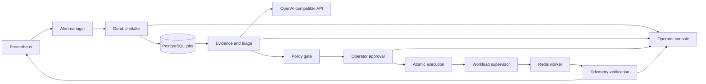

<div align="center">
  <h1>Triovexa</h1>
  <p><strong>Approval-gated incident response for stalled workers and queue backlogs.</strong></p>
  <p>Triovexa turns monitoring alerts into evidence-backed, policy-constrained remediation and verifies recovery from live telemetry.</p>
  <p>
    <a href="go.mod"></a>
    <a href="ui/package.json"></a>
    <a href="LICENSE"></a>
  </p>
  <p>
    <a href="#quick-start">Quick start</a> ·
    <a href="#how-it-works">How it works</a> ·
    <a href="docs/README.md">Documentation</a> ·
    <a href="docs/evidence/README.md">Verified evidence</a>
  </p>
</div>

https://github.com/user-attachments/assets/52ab8593-d933-4e3f-9c02-bc534e432635

## Why Triovexa?

Alerts identify symptoms, but recovery still requires an operator to gather context, choose a safe action, execute it, and confirm that the service actually improved. Triovexa brings those steps into one auditable workflow.

A Prometheus alert starts durable triage. Triovexa collects current evidence, uses an OpenAI-compatible model to produce a structured diagnosis, validates the proposed action against policy, and waits for an authorized operator. Execution goes through a constrained supervisor API, while recovery is decided from subsequent workload telemetry rather than a successful HTTP response.

The included playground exercises the complete path with a real Redis Streams producer and worker.

## Product highlights

| Capability | What it provides |
| --- | --- |
| Evidence-backed triage | Correlates alert context, workload metrics, logs, runbooks, and previous incidents. |
| Guarded reasoning | Validates structured model output against the same action catalog and policy used by execution. |
| Bound approvals | Ties approval to the exact action, parameters, target, evidence, and policy version, with expiry. |
| Constrained execution | Exposes only allowlisted workload operations through an authenticated supervisor API. |
| Verified recovery | Requires three consecutive healthy observations and reports missing or stale telemetry as inconclusive. |
| Durable workflows | Persists intake, jobs, approvals, audit events, and execution state in PostgreSQL with crash recovery. |
| Operator console | Provides incident search, evidence, approvals, execution, verification, activity, and connection health. |
| Built-in observability | Ships a local Prometheus, Alertmanager, Grafana, Loki, and Alloy stack with provisioned rules and dashboards. |

## How it works



The reference scenario follows this sequence:

1. A worker stall causes the Redis backlog to grow.
2. Prometheus fires an alert and Alertmanager delivers it to Triovexa.
3. Triovexa persists the incident and triage job before accepting the webhook.
4. Evidence collection and model reasoning produce a bounded restart recommendation.
5. An operator reviews and approves the exact action.
6. The supervisor restarts the worker with a stable operation ID.
7. Triovexa confirms that processing resumed, the backlog fell, and errors remained healthy across three observations.

The recorded output and validation boundaries are published in [the evidence report](docs/evidence/README.md).

## Safety model

Triovexa treats remediation as a stateful, security-sensitive workflow:

- actions and targets must exist in the server-side allowlist;
- the Triovexa service receives neither a Docker socket nor arbitrary command execution;
- approvals expire and are invalidated when action inputs, evidence, or policy change;
- evidence freshness is checked again immediately before dispatch;
- execution claims are atomic, idempotent, and limited to one active action per target;
- stable operation IDs allow reconciliation after uncertain external effects;
- authenticated browser mutations use CSRF and origin validation in internal mode;
- webhook authentication, payload limits, and rate limiting protect alert intake;
- a persisted kill switch blocks new approvals and executions.

## Quick start

### Requirements

- Docker Desktop with Docker Compose
- PowerShell 7 or Windows PowerShell 5.1
- An API key for an OpenAI-compatible Chat Completions endpoint

### Start the playground

```powershell
git clone https://github.com/Cyaside/Triovexa.git
cd Triovexa
docker compose -p triovexa-e2e up -d --build
```

Open the [Connections page](http://127.0.0.1:8080/ui/connections), enter the API root, model, and API key, then run **Test connection**. The key is encrypted before it is stored in PostgreSQL and remains available after container restarts.

Run the complete recovery scenario:

```powershell
./scripts/demo.ps1 -SkipBuild
```

The script injects a bounded worker stall, waits for a real alert, completes approval and execution, verifies recovery, and leaves the stack running for inspection.

| Service | URL |
| --- | --- |
| Operator console | <http://127.0.0.1:8080/ui/incidents> |
| Grafana | <http://127.0.0.1:3300> |
| Readiness | <http://127.0.0.1:8080/health> |

Stop the project while preserving its data:

```powershell
docker compose -p triovexa-e2e down
```

## Operator console

The React and TypeScript console is embedded into the Go server, so production deployments do not require a separate frontend runtime. It includes:

- incident search, filters, and server-side pagination;
- evidence, proposed actions, verification results, and audit history;
- approval and execution controls with explicit conflict handling;
- dependency health for Grafana, Prometheus, Alertmanager, Loki, and the reasoning provider;
- reasoning-provider configuration and connection testing;
- Grafana onboarding and query preview;
- bounded fault controls for the local playground;
- loading, empty, stale, disconnected, forbidden, and conflict states.

## Reasoning configuration

Triovexa uses the OpenAI-compatible Chat Completions contract with string message content and optional JSON response mode. Configure these fields from **Connections**:

- API root
- model name
- API key
- JSON response-mode support

Every response passes through schema, action-catalog, and policy validation before it can reach approval. Provider, model, prompt version, latency, token usage when reported, and fallback reason are attached to the incident audit trail. Provider failures are visible to operators; deterministic reasoning remains available for development and failure testing.

Internal deployments accept only HTTPS provider endpoints from an administrator allowlist. Local mode may connect to an HTTP endpoint on loopback.

## Deployment modes

| Mode | Intended use | Enforcement |
| --- | --- | --- |
| `local-demo` | Local evaluation and the Compose playground | Development identity, loopback-compatible connections, bounded demo workload. |
| `internal` | A single trusted team or staging environment | PostgreSQL, authenticated accounts, role-based access, CSRF and origin checks, webhook credentials, HTTPS provider allowlist. |

The current action catalog targets the included Redis worker. Additional integrations should add typed operations, target validation, reconciliation, and recovery criteria instead of exposing a general shell.

## Development

Build and test the backend:

```powershell
go test ./...
go vet ./...
```

Build and test the console:

```powershell
cd ui
npm ci
npm run build
npm run test:e2e
```

CI also runs the Go race detector, PostgreSQL and Redis integration tests, migration re-entry, and PostgreSQL backup and restore verification.

## Documentation

- [Architecture](docs/architecture/final-architecture.md)
- [Action catalog](docs/operations/action-catalog-v1.md)
- [Policy rules](docs/operations/policy-rules-v1.md)
- [Testing strategy](docs/operations/testing-strategy.md)
- [Verified end-to-end evidence](docs/evidence/README.md)
- [Release notes](docs/releases/v1.0.0-rc1.md)

## Project scope

Triovexa currently supports a single-tenant deployment and one bounded Redis worker integration. The same workflow can be extended through typed adapters, but compatibility and recovery semantics must be established for each target system. OpenAI-compatible endpoints also vary; Triovexa supports the Chat Completions subset described above.

## Future scope

### Code-repair workflow

Triovexa could extend its incident workflow to help repair source-level defects when operational remediation does not restore the service:

```text
Unresolved incident
→ collect logs, traces, deployed commit, and evidence
→ operator authorizes code investigation
→ coding agent creates an isolated branch or worktree
→ agent proposes a patch and runs the relevant tests
→ agent opens a pull request
→ CI and human reviewers validate the change
→ deployment pipeline rolls out the approved fix
→ Triovexa verifies recovery from production telemetry
```

This workflow would preserve explicit authorization, existing repository protections, CI, human review, and deployment controls. Triovexa would connect the original incident to the resulting pull request, deployment, and recovery evidence without directly merging or deploying generated code.

## License

Triovexa is available under the [MIT License](LICENSE).
