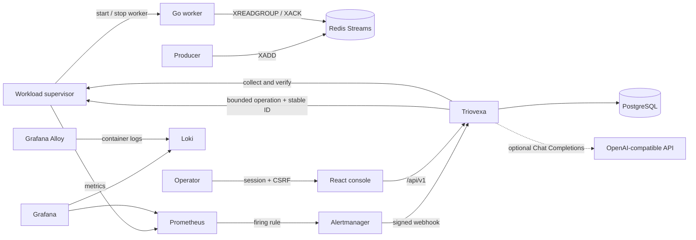

# Final architecture

Triovexa is a single-instance incident response service for a bounded worker-stall use case. The product boundary is deliberate: it can restart, pause, or resume one allowlisted Redis Streams worker through a dedicated supervisor API. It cannot execute arbitrary commands or access the Docker socket.

## Accepted alert path

Alertmanager sends a bounded Grafana-compatible payload. Triovexa rate-limits and authenticates the webhook, normalizes every `alerts[]` member, distinguishes duplicate deliveries from new episodes, and stores the incident, intake audit event, and triage job in one PostgreSQL transaction before acknowledging the request.

Two database workers claim jobs with leases sized for both provider calls and the final writes. Conditional state transitions prevent an old job from overwriting newer incident state. Bounded retries and startup recovery preserve accepted work across process restarts, including jobs that exhausted their attempts while the incident still requires triage.

## Decision path

Evidence collection, document retrieval, triage, action generation, and policy evaluation remain separate. The primary reasoning path uses OpenAI-compatible Chat Completions, validates structured output, and falls back to deterministic development logic when the endpoint times out or returns invalid data.

The provider API key is encrypted with AES-256-GCM before persistence. PostgreSQL stores only ciphertext and non-secret connection metadata; the encryption key is kept in a separate runtime volume or injected by the deployment environment.

Every proposal passes the same catalog validation. Triovexa refreshes workload evidence after triage and uses that snapshot for action generation. Approval binds the exact action type, parameters, target, policy version, and evidence digest for 15 minutes. The server revalidates this snapshot and its 60-second freshness limit immediately before dispatch.

## Execution and reconciliation

An atomic database claim permits one active execution per target. The network call happens outside the transaction and carries a stable operation ID. The workload supervisor stores operation results so Triovexa can reconcile a crash after the external effect but before its local result was persisted. Startup recovery examines records left in `started` state.

The action catalog contains only `restart_worker`, `pause_consumer`, and `resume_consumer` for the real workload. Restart is not presented as reversible. Pause can be compensated by resume only when Triovexa knows the initial state and owns the change.

## Verification

Collection and verification use the same workload contract: target, source, timestamp, completeness, worker health, backlog, processing progress, and errors. Triovexa captures a pre-action baseline and polls every ten seconds for up to two minutes. Recovery requires three consecutive observations with a healthy worker, cleared alert, backlog reduction or empty queue, and no worsening error signal. Missing or stale evidence yields `inconclusive`.

## Deployment modes

`local-demo` binds to loopback and allows a loopback HTTP reasoning endpoint. `internal` requires PostgreSQL, authentication, HTTPS provider endpoints from an administrator allowlist, origin validation for browser mutations, and separate webhook credentials. The persisted kill switch blocks new approvals and executions in both modes.

